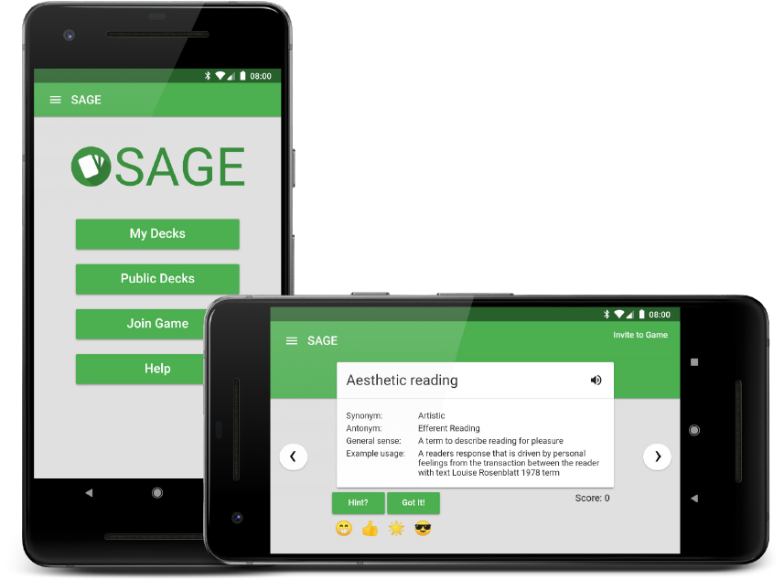

# 

## Table of Contents
- [Getting Started](#getting-started)
- [What is SAGE?](#what-is-sage)
- [Features](#features)
- [Using SAGE](#using-sage)
  - [As a Teacher](#as-a-teacher)
  - [As a Student](#as-a-student)
- [Documentation](#documentation)
- [Browser Support](#browser-support)
- [Authors](#authors)
- [Built With](#built-with)

## Getting Started

Start playing now at [sage.cards](https://sage.cards/)!

## What is SAGE

<!-- EDIT THIS -->
SAGE is a game for teachers and students who want a way to improve student vocabulary. SAGE is an educational tool that is peer-based, customizable, and fun. It is designed for a classroom setting.

*SAGE* is an acronym for synonyms, antonyms, general sense, and example usage. A SAGE card includes a word and has one hint from each of the 4 listed categories. In a game of SAGE, there are a number of cards the player will be presented with, each of them being worth points. The player is initially given just the word for a card. It is up to them to either guess the meaning of that word, or ask for a hint at the expense of some points.

The game is played between at least 2 people, with one or more people trying to guess the meaning of a word through hints and one person controlling the game and deciding whether they are right or wrong.

### How to play SAGE

A game of SAGE consists of the host, as well as the players. 

The host is the one who has the cards, gives out hints, and decides whether the player's guess is correct. 

The players are the ones who try to correctly guess the meaning of a word, ask for hints when stuck, and try to score as many points as possible.

Each SAGE card is worth a maximum of 5 points. Every time a player asks for a hint, they randomly receive a hint from one of the categories and lose 1 point. A player can ask for a hint up to 4 times, one hint from each category. The player may guess the meaning of a word at any time. If correct they will receive the points they have left on that card. If the player can still not get the definition correct the host may move on to the next card and the player recieves no points.

The game is over once a host goes through all the cards in a deck. If the players want, they can have the host go back through all the cards to see how they did on each individual card, allowing the players to see where they need to improve.

### Rules of SAGE

- SAGE is played with two or more people, with one person being the host and the other(s) playing the game.
- The point of the game is for the player(s) to guess what the definition of a word is on a card.
- Each word has four hints: a synonym, an antonymn, a general sense and an example usage. A player may ask for a hint to help them guess the definition, but the hints are random.
- A card may have multiple synonyms and antonyms. If it does a singular hint will be picked for both categories at random at the start of a game.
- Each card starts with 5 points. Each time a hint is used, a point is deducted.
- If the player(s) don't guess the definition correctly, move on to the next card. If they guess correctly, press the "Got it!" button.

## Features
- **Classrooms**
A classroom allows teachers to share their decks and organize their students together
- **Decks**
A collection of SAGE cards, can apply tags to decks to categorize them
- **Multiplayer**
The game is played online, led by a host who has a numerical/QR join code that players can use to join the game. 
- **Google Accounts**
A user may sign in to the site using their google account. This allows them to make their own decks and classrooms as well join pre-existing classrooms.
- **Shared Decks**
As a teacher you may allow students to contribute to decks in your classroom by unlocking them. Once you do this, histories will be tied to the cards allowing you to see which students created and edited them. If you want, you may also re-lock the deck whenever you wish, locking students from editing or adding cards

## Using SAGE

### As a Teacher

<!--(Have screenshot of sidebar menu, and another with the 'Add New Class' window open, or probably just a gif of you making a class, starting from the home screen without the sidebar open)-->
The first thing a teacher will want to do is make a classroom. The way to do this is to open the sidebar and click the plus symbol next to 'Classes'. Then, all they have to do is type their desired class name, click 'Add Class', and it will appear in the sidebar menu. 

<!--(Have screenshot of newly made classroom)-->
From here, the 'Sharing' section includes everything a teacher will need to bring students into their classroom. Either the students can use their phones to scan the QR code, or the teacher can send students the Join Code for them to copy into their browser. A teacher can also kick any students in their class, or make any student a teacher.

<!--(Have gif of adding a deck in a classroom)-->
To make a deck, click the circular plus button in the bottom-right corner of the screen. Then, simply type the deck name and click 'Add Deck' and then deck will appear under the class title.

<!--(Have gif of making a card in said deck)-->
From within this deck, click the same plus button to add cards to this deck.
<!--(Have screenshot of menu)-->
It is from here that the teacher can also choose to delete the deck, move the deck to another class, or enable students the ability to add cards.

<!--(Have screenshot of play buttons)-->
Either from within the deck, or viewing it from the deck list, the teacher can begin a game. They can click 'Invite to Game', which gives a join code that students can use. From here the game has begun. To give players a hint they can click the 'Hint?' button which will highlight a random hint for them, and send that hint to the players. If the players guess the word correctly, the teacher can click 'Got It!', which will increment the points, as well as slide to the next card.

At any point in the game, teachers can flip through any cards in the deck, as well as go back to others, and the amount of hints and points remaining for any given card will remain the same. 

### As a Student

The first thing a student will want to do is log-in with their google account. This will allow them to create and manage their own decks on the 'My Decks' page.

After they have logged-in, a student can join a classroom by scanning a QR-code or by receiving a join link from a teacher. Once they have joined a class, students will only be able to see the deck list and the list of other students. From here they can either look at the decks in the deck list, play with a deck, or choose to remove themselves from the class.

<!--(Have screenshot of player view of a sage game, or probably just a markdown table of two gifs side by side; one of the host, one of the player)-->
If a teacher is running a game of SAGE, a student can join by either scanning the QR-code or entering the join code on the 'Join Game' page. Once they are in the game, a student will see just the word of the given card. A student can either guess the meaning of the word displayed or ask for a hint from the teacher.

## Documentation

- [Development Instructions]()
- [Deployment Instructions]()
- [Teacher Guide]()
- [Advert Document]()

## Testing and Continuous Integration

SAGE uses Jasmine and Karma for unit testing through the Angular CLI. TravisCI is configured to run these tests.

## Authors

SAGE was build by a team of students for a software design class at the University of Minnesota Morris. See the GitHub [contributors page](https://github.com/UMM-CSci-3601-F17/sage-team-cheezit/graphs/contributors).

## Built With

SAGE is powered by:
- [Angular](https://angular.io/)
- [Angular Material](https://material.angular.io/)
- [Teradata Covalent](https://teradata.github.io/covalent/)
- [Firebase](https://firebase.google.com/)
    - [Cloud Firestore](https://firebase.google.com/products/firestore/)
    - [Realtime Database](https://firebase.google.com/products/realtime-database/)
    - [Authentication](https://firebase.google.com/products/auth/)
    - [Hosting](https://firebase.google.com/products/hosting/)
- [AngularFire](https://github.com/angular/angularfire2)

Other libraries used:
- [ng2-page-slider](https://github.com/KeatonTech/Angular-2-Page-Slider)
- [ng2-rx-componentdestroyed](https://github.com/w11k/ng2-rx-componentdestroyed)
- [ngx-qrcode2](https://github.com/techiediaries/ngx-qrcode)
- [ngx-pipes](https://github.com/danrevah/ngx-pipes)
- [ngx-clipboard](https://github.com/maxisam/ngx-clipboard)
- [time-ago-pipe](https://github.com/AndrewPoyntz/time-ago-pipe)

Tools:
- [Angular CLI](https://cli.angular.io/)
- [Yarn](https://yarnpkg.com/)
- [TypeScript](https://www.typescriptlang.org/)
- [Karma](https://karma-runner.github.io/1.0/index.html)
- [Jasmine](https://jasmine.github.io/)
